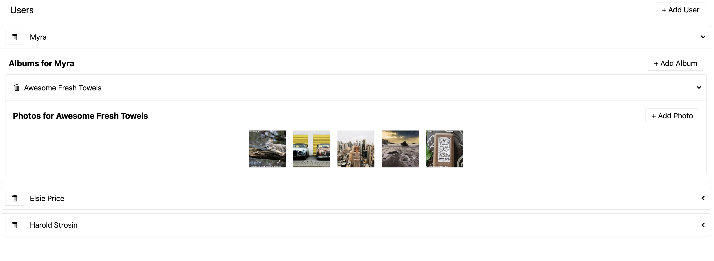

# React_Media_List

Repository created following this [Udemy Course](https://www.udemy.com/course/react-redux/) to practice the following basic React concepts:

- Redux Toolkit
- Redux Thunks
- Redux Toolkit Query

## Application

Application fetch a list of users when loading. When opening each user panel, a lot of albmus will be fetched. Last but not least, when opening each user album, you will see a list of photos.

All this behaviour is handled with async communication to an internal json-server database through Redux thunks & Redux toolkit queries.



## Run Locally

Clone the project

```bash
  git clone https://github.com/pedrolopezbiedma/React_Media_List.git
```

Install dependencies

```bash
  npm install
```

Start the server in another console

```bash
  npm run server
```

Start the application

```bash
  npm run start
```

## Authors

- [@pedrolopezbiedma](https://github.com/pedrolopezbiedma)
